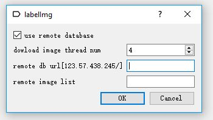

# LabelImg

LabelImg is a graphical image annotation tool.

It is written in Python and uses Qt for its graphical interface.

The annotation file will be saved as an XML file. The annotation format is PASCAL VOC format, and the format is the same as [ImageNet](http://www.image-net.org/)

## Dependencies
* Linux/Ubuntu/Mac

Requires at least [Python 2.6](http://www.python.org/getit/) and has been tested with [PyQt
4.8](http://www.riverbankcomputing.co.uk/software/pyqt/intro).

In order to build the resource and assets, you need to install pyqt4-dev-tools:

`$ sudo apt-get install pyqt4-dev-tools`

`$ ./labelImg.py`

* Windows

Need to download and setup [Python 2.6](https://www.python.org/downloads/windows/) or later and [PyQt4](https://www.riverbankcomputing.com/software/pyqt/download). You can also try to download the whole neccessary executable files from [my drive](https://copy.com/oyYjFzJwPb4tKl93) and install them.

Open cmd and go to $labelImg, 

`$ pyrcc4 -o resources.py resources.qrc`

`$ python labelImg.py`

## Usage
After cloning the code, you should run `$ make all` to generate the resource file.

You can then start annotating by running `$ ./labelImg.py`. For usage
instructions you can see [Here](https://youtu.be/p0nR2YsCY_U)

At the moment annotations are saved as an XML file. The format is PASCAL VOC format, and the format is the same as [ImageNet](http://www.image-net.org/)

You can also see [ImageNet Utils](https://github.com/tzutalin/ImageNet_Utils) to download image, create a label text for machine learning, etc

### Create pre-defined classes

You can edit the [data/predefined_classes.txt](https://github.com/tzutalin/labelImg/blob/master/data/predefined_classes.txt) to load pre-defined classes

### General steps from scratch

* Build and launch: `$ make all; python labelImg.py`

* Click 'Change default saved annotation folder' in Menu/File

* Click 'Open Dir'

* Click 'Create RectBox'

The annotation will be saved to the folder you specifiy

### Hotkeys

* Ctrl + r : Change the defult target dir which saving annotation files

* Ctrl + n : Create a bounding box

* Ctrl + s : Save

* Right : Next image

* Left : Previous image

### Online Image Data Mode

the server have to make the images in a folder that clint can get from http/https with **get** function

1. settings

open File -->RemoteDBSettings(ctrl+m) like that

the remote image list is a file contenting the name of the images (a line is a image) the image will be cached in a folder

created in the software file named database/pics/XXXX and this will take a lot of memory if there are a lot of images,and this

will be modified in the future

open File   -->ChangedDefaultSavedAnnotationDir(ctrl+r) to set the folder to save the results

2. if your settings are right,you will find the **Get Images** button becomes enabled and click it ,then you can annotate the images as before

### How to contribute
Send a pull request

### License
[License](LICENSE.md)
